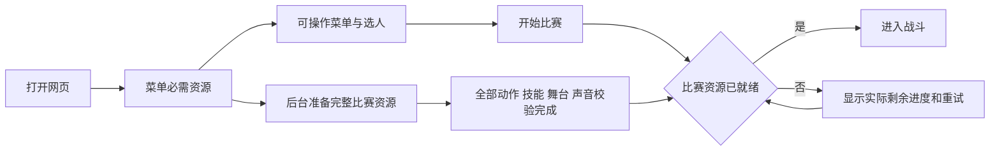

# 加载提速复盘与方案0915

状态：2026-09-15用户批准后，网络编码、分阶段加载、资源复用和原网址更新已实施。本文件保留实施前依据与目标，实际结果见[加载提速交付0915](加载提速交付0915.md)。用户没有云账号及备案域名，国内入口尚未开通；受控模拟与大陆线路实测不混用。

**结论：上轮解决了“下载超时后进不了游戏”，没有解决“玩家需要等很久”。本轮应同时缩小发布素材、拆开菜单与比赛加载、复用已验证资源，并为大陆玩家准备国内访问入口。继续延长超时或增加下载并发不是主要提速手段。**

## 1. 69秒究竟花在哪里

依据：当前源码提交`e5193c1`及上轮浏览器记录`.local-releases/公网加载修复-0914/acceptance/slow-5mbps-complete.json`。这份记录来自本机无缓存、150ms延迟、625000字节/秒，即5Mbps的受控模拟，不是另一台电脑的实测网速。

按浏览器记录的传输字节统计，MB采用十进制：

| 实际请求资源 | 请求数 | 传输量 |
|---|---:|---:|
| 两角战斗图集及界面人物PNG | 6 | 32,565,334字节，32.57MB |
| 打击、技能、人物等短音 | 70 | 4,785,938字节，4.79MB |
| 两角技能图集及配置 | 4 | 2,073,606字节，2.07MB |
| 舞台 | 2 | 1,220,610字节，1.22MB |
| 游戏及Phaser脚本 | 2 | 423,588字节，0.42MB |
| 其他人物元数据 | 6 | 43,118字节，0.04MB |
| 合计 | 90 | **41,112,194字节，41.11MB** |

人物占传输量约79.21%。在上述带宽下，单纯传输这些字节的理论下限是`41,112,194 / 625,000 = 65.78秒`。实际最后一份短音在导航后68.822秒完成，之后进入标题。两者接近，说明本次模拟的首要问题是需要传输的素材太大。

人物最后一张图在59.620秒结束；短音从60.071秒开始，到68.822秒结束。不能将并行文件的下载时间相加，也不能将8.75秒音频阶段直接算成“全部能被并行省掉”：它的字节仍要占用相同带宽。

发布包整体47.41MB与首次实际下载41.11MB是两种口径。旧像素文件虽在回退包里，却没有出现在这次动漫冷启动请求中；删除它们不能解决本次等待。背景音乐已经流式播放，也不是这70份短音的全部组成。脚本传输仅约0.42MB，现阶段优先拆引擎收益有限。

**尚不知道：**失败电脑当前的实际吞吐、网络路由及新版进入情况。现有证据不能证明69秒全由GitHub线路造成，也不能证明其他网络一定只需69秒。

## 2. 之前的方案为什么不够

1. **先为完整性设计了门槛，却把门槛放到了标题之前。** `Boot → Preload → Title`在出现标题前就下载两角所有动作、舞台、技能和70份短音。标题、设置和选人实际用不到全套战斗图集。这使“不能缺动作进入战斗”扩大成了“没下载整场游戏就不许操作菜单”。
2. **把高分辨率PNG直接作为网络交付格式。** 原图密度解决了人物清晰度，但缺少单独的网络编码与体积预算。素材制作格式与网页分发格式没有分开。
3. **已有纹理并未避免重复加载。** 选人和重赛仍经过Preload；`loadAnimeCharacters`先清掉对应人物的就绪记录，再请求配置、图片、算哈希和解码，随后才判断同内容纹理是否已注册。HTTP可能复用缓存字节，但这条路径仍会请求并重复处理。
4. **验收只证明了慢网能成功。** 上轮将总包8秒期限改成逐文件90秒、有限并发和重试，确实避免误判失败；但没有设“多久能操作、多久能出拳”的体验门槛。将超时修复通过当作加载体验完成，是本轮需要纠正的判断。
5. **大陆访问目标没有进入发布设计。** GitHub Pages已经验证能部署，但没有进行目标玩家网络的线路比较。它可以保留源码和备用入口，不应仅凭开发机可访问就认定适合作为大陆玩家唯一入口。

源码定位：`src/render/scenes/BootScene.ts`、`PreloadScene.ts`、`CharacterSelectScene.ts`、`ResultScene.ts`、`src/render/assets.ts`、`src/render/assetDownloads.ts`、`src/audio/AudioEngine.ts`、`scripts/build_anime_atlas.py`及`scripts/packagePages.mjs`。

## 3. 已做的压缩实验

没有重新生图。使用现有8张PNG，在系统临时目录转码，再解码比对；未替换任何正式资源。

| 实验编码 | 6张人物图合计 | 2张技能图合计 | 质量证据 |
|---|---:|---:|---|
| 现有PNG | 32.56MB | 2.07MB | 原发布素材 |
| 无损WebP | 25.05MB | 1.77MB | 8张RGBA逐字节一致 |
| WebP质量95 | **8.85MB** | **0.88MB** | 8张透明度完全一致；颜色有损 |
| WebP质量90 | 7.25MB | 0.77MB | 8张透明度完全一致；颜色有损 |
| AVIF质量90、4:4:4 | 8.38MB | 0.80MB | 透明度发生变化；需另行验证 |

这里的文件体积不含HTTP头，与上一表浏览器传输字节有小幅差异。仅替换上述8张图、其他资源不变，按已测文件长度计算：无损WebP版本首访约33.30MB，5Mbps纯传输下限53.28秒；质量95候选约16.20MB，下限25.92秒。这些是计算结果，**不是新版本浏览器加载时间**。

实际查看了路飞、赤犬各一帧idle在正常帧尺寸、暗背景下的对照。质量95候选未见明显辨识度或轮廓损坏，但尚未覆盖所有动作、透明火焰、缩放和投技分层，不能计为整体画质通过。

AVIF质量90实验中透明度最大变化约9至18/255，不能直接用于当前需要精确合成的前景层。Python解码耗时也不能替代浏览器解码、上传纹理和帧时间实测。首轮不选择AVIF作为默认方案。

实验记录位于`C:/Users/august/AppData/Local/Temp/opf-loading-review-0915/`：`benchmark.py`、`results.json`、`avif_probe.py`、`avif-results.json`、`compare.py`及`codec-comparison.png`。临时文件不是运行素材；实施时按既有素材规范保存正式编码参数、母版映射和哈希记录。

## 4. 推荐实施方案

### 第一步：制作网络发布素材，保住清晰度与动作

- 保留现有PNG母版、原图来源、双倍纹理密度、画布档位、动作帧和战斗数据。此次只重编码已有像素，不调用生图或网页Pro。
- 普通人物页、界面人物及技能页以WebP质量95作为首个候选，逐页检查。面部、细线、火焰边缘等出现可见退化的页保留无损；质量参数本身不代表验收通过。
- **投技前臂等有逐像素合成约束的帧，与其关联人物主体，一起保留无损。** 它们目前混在赤犬主图集中；应按既有动作分页规则拆到独立无损页，保持帧坐标、根点、连接点和时序含义一致，复核分层合成像素。不能只保住alpha就宣称满足原RGBA一致性要求。
- 同步更新合法文件格式、分页元数据、内容哈希与打包白名单，不能仅把`.png`改成`.webp`后绕开校验。为后续缓存采用内容哈希文件名和显式发布清单。
- 重打包需要检查图集总面积及纹理数量。现有战斗分页原始RGBA合计176MiB；网络压缩不会自动减少这部分显存，新增无损页也不能无控制地扩大纹理占用。

**放行依据：**720p、1080p实际显示；两角全部动作与技能；左右朝向；近身接触、投技前景接缝和半透明边缘。验收后才能得到正式包体积，不能将实验的8.85MB直接写成已完成交付。

### 第二步：先能操作菜单，同时准备完整比赛

流程改为：

- 菜单只加载高清界面人物、现有远景、小量菜单声音及代码，目标首屏传输不超过1.5MB。脚本开始运行后先保证菜单资源优先级，再在后台准备比赛，避免大文件抢占首屏。
- 比赛包包含将使用的两角全部动作、必需技能与舞台；战斗短音完成下载和预解码。未解锁音频与下载失败分别显示，保留用户的静音选择、试听和重试。
- 使用同一套有限并发和优先级队列，音频与图像按需要调度，不再固定“所有图完成后才开始所有声音”。背景音乐保持流式，避免低优先级音乐下载压住首场关键资源。
- 菜单与战斗使用不同的完整性检查集合。界面人物单独就绪，不再依赖整个角色动作包注册。进入Fight前仍检查完整比赛资源，不在出招时临时下载动作，不以合成提示声代替尚未取得的正式声音。
- 总等待显示真实字节进度、阶段及失败项；不能按文件数让15MB大图与小配置占同样进度权重。直接打开训练、完整比赛、旧版入口分别保留合法加载路径。

### 第三步：让再访、选人和重赛真正复用资源

- 已验证的资源按发布版本、角色和内容哈希登记。纹理仍存在且版本一致时，直接复用元数据、纹理和声音缓存；共享正在加载的任务，避免多场景重复请求。
- 切换版本或主动重试失败资源时才重新取对应文件。新版本不完整时不能混用旧人物页，也不能因此静默切回像素版。后台任务不应依赖已销毁的菜单场景；迟到结果只能进入自己的版本资源记录。
- 为已经通过哈希检查的文件增加浏览器持久缓存，优先使用CacheStorage，无需先引入Service Worker。小发布清单向服务器再验证，大文件按内容身份复用；缓存损坏重新取，配额不足正常走网络并说明状态。
- 同一次页面运行不反复算同一份已验证大图的哈希，也不重复解码。页面重开仍执行必要完整性检查。浏览器清理缓存、隐私模式、换访问域名都可能重新冷启动，不能将缓存收益算到首次访问。
- 发布按“先上传内容哈希文件、最后切换清单和首页”执行，保留旧资源以支持正在进行的对局与回退；不清理历史或改CI/CD。

### 第四步：压缩声音，但保留听感和触发时机

- 当前70份短音约4.79MB，仍有优化价值。按公共音效、路飞、赤犬分成少量音频资源包，尝试浏览器支持的压缩音频候选；事件映射、切片起止和所有正式短句保持完整。
- 试听重点是轻重击瞬态、低音爆裂、橡胶回弹和日语首尾；校验编码延迟、切片串音、循环接缝、暂停退出和失败重试。短音必须预解码，不能命中后才解码而增加打击延迟。
- 声音体积暂以约1.5MB作为预算目标，**尚无编码或听感实测支持达成此目标**。如果少量音频包的切片质量不合格，采用独立压缩文件；不为减少请求数破坏声音。
- 本轮不重做人物声线、不删待机和走路声音、不压低音量制造“听不出失真”。

### 第五步：面向中国大陆提供合适的访问入口

- 推荐GitHub继续保存源码与备用游玩地址，新增国内静态托管或对象存储加CDN作为主要游玩入口。候选可从腾讯云COS/CDN、阿里云OSS/CDN中优先复用已有账号和域名；不自建游戏服务器、不改变静态部署性质。
- 选型依据是同一份瘦身包在目标网络的实际首访表现，以及账号、域名、备案条件和费用。具体套餐、可用域名与当前服务要求尚未核验，本方案不指定未经验证的付费资源或宣称免费可用。本次官方文档网络读取失败，因此不把服务商接入条件写成已完成的核实结果。
- **原`github.io`域名不能直接换成国内节点。** 推荐交付一个新的主游玩链接，保留原网址备用。若只将图片指向国内存储而保留GitHub首页，打开网页的第一跳仍然受GitHub访问影响，不能算完整解决。
- 网页、脚本及素材尽量同源交付，核对HTTPS、缓存头、媒体类型和压缩传输；必要的跨域请求明确配置。两个入口使用同一个发布清单与文件哈希，避免版本分叉。
- 域名或账户条件未齐时，先在原网址完成前四步。不会将“换一个海外免费托管平台”直接标记为大陆加速，也不把等待外部条件变成停止代码与素材工作的理由。

## 5. 验收目标与完成标准

以下是实施前约定的目标，**不代表任何网络条件下的速度承诺**；当前达成情况以交付记录为准：

| 场景 | 推荐目标 | 统计口径 |
|---|---|---|
| 首访，5Mbps、150ms、无缓存 | 4秒以内菜单可操作 | 从导航开始，到菜单真实接受输入；不是只出现标题字 |
| 同样慢网条件下的第一场 | 25秒以内能出拳 | 固定脚本以最早可操作时机选人进入；不扣除点击后加载、解码和比赛开场时间 |
| 国内入口、实测有效吞吐至少20Mbps | 首场10秒以内能出拳 | 同一份完整素材、相同画质；实际网络条件随结果记录 |
| 同版本再次访问、持久缓存正常命中 | 5秒以内菜单可操作 | 记录真实缓存命中；另测首场时间，不混同页内重赛 |
| 同页重新选人、重赛 | 不再请求或重复解码已就绪大资源；额外资源等待1秒以内 | 正常开场演出单列，不能误报成加载时间 |

首场必要传输预算目标约12至13MB，其中人物及技能以质量验收后的实际混合编码包为准。13MB在5Mbps下仅传输就需20.8秒，留给初始化、校验、解码和开场的余量有限。因此：

- 仅采用全图质量95实验候选、保留现有音频，理论传输就要25.92秒，不能声称只换图片即可达成25秒目标。
- 画质保护导致正式包超预算时，继续优化分组、编码和音频；仍不达标就明确报告目标缺口，不降低人物纹理密度或删动作凑成绩。
- 有效吞吐不足的网络仍会更慢。国内入口用于减少线路不稳定，不改变字节与带宽的关系。

实施后的检查包括：冷缓存、再访、同页重赛、配置更新、404、超时、缓存损坏、缓存配额失败、重试恢复、页面离开时任务结束；菜单与全部比赛模式；两角完整动作、投技分层及声音。Chromium桌面浏览器实际复核，并记录其他声称支持的浏览器范围。

对每次受控启动至少区分：导航、菜单可操作、关键资源传输完成、哈希/解码完成、Fight出现、首个有效出拳。网络传输、解码与纹理上传分别记录；不得使用无界面逻辑循环作为网页加载性能证据。重复冷启动对照并保留每次结果，不只展示最快一次。

四项工程检查在实际代码改动后执行：`npm run typecheck`、`npm run lint`、`npm test`、`npm run build`。原规划阶段只有文档与临时转码实验；实施后的代码、构建与浏览器检查已另存交付记录。没有改战斗逻辑，不要求用户再次保持窗口置顶15分钟；若浏览器检查暴露纹理/音频增长，再做针对性持续运行验证。

## 6. 决策记录与实施顺序

采用“网络编码与按场景加载 → 资源复用 → 音频压缩 → 大陆入口对照与发布”的顺序。前三类工程收益可在现有地址验证，国内账号和域名条件核实时同步推进，不相互阻塞。

不重写引擎，不改伤害、范围、时长，不降低人物原画密度。无损压缩单独采用收益不足；WebP质量95有明显体积收益，但必须保留敏感帧无损并通过画面验收；AVIF暂不默认采用。暂不引入复杂PWA、跨站多源竞速或GPU专用压缩纹理管线。

实施前沿用既有目录约定保存清单与回退，更新项目约定后再引入新发布资源结构。正式新增记录按主题加0915命名；素材来源、PNG到发布格式的参数与哈希映射放`docs/assets/`，不覆盖GPT Image 2.5生成依据。新托管服务的账号、域名和任何付费事项先明确条件与具体选择，再执行相关操作。

实施结果：普通图页采用经对照检查的质量93 WebP，敏感分层帧保留无损，声音独立编码后合并下载；本机5 Mbps三次冷启动均达到菜单4秒、首拳25秒目标。原公开入口和本地提速包已更新。国内入口、真实大陆线路及重新编码后的主观听感仍分别保留待验，完整证据见[加载提速交付0915](加载提速交付0915.md)。
