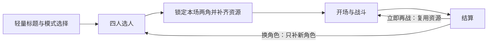

# LABUBU与星星人：联动角色与体验升级计划0922

2026-09-22。**状态：用户已回复“按计划实施”，当前获批实施中。** 已确认的目标、人物、画风和声音见[规划决策记录](联动升级规划决策0922.md)。实施状态以[联动实施记录0922](联动实施记录0922.md)为准，计划不冒充完成。

## 1. 这版要交付什么

新增 **LABUBU＋星星人（Twinkle Twinkle）**，与路飞、赤犬组成四人阵容。保留潮玩头身比例与毛绒/搪胶质感，采用原创萌系声线。目标是玩家愿意选新角色、能很快开打，并愿意主动再玩一局。

本版建议包含：两名完整角色、各九个一键技能、独立CPU与教学配置、四人选人页、战斗信息整理、按参战者加载、旧CPU重拳问题的复现与有证据修补。保留1v1、人机、本地双人、训练和经典/一键操作；舞台与背景音乐沿用当前版本，不同时扩展新舞台、联机、触屏或组队模式。

【事实】目前 core 支持确定性的位移、多段攻击、地面对空判定、投技、飞行道具、反弹、霸体及强化数据，足以承载下述角色原型。新增角色规则在角色数据中实现，保留固定60Hz、整数坐标和输入缓冲；旧角色伤害、判定、起手/收招、耗气与取消规则冻结。CPU行为修补在`src/ai`独立评估。

【推断】扩充角色能增加新鲜感，但如果动作不连贯、打法相同或同一招仍能反复压制CPU，就不足以证明复玩改善。因此先做可操控样板与加载结构，再扩完整素材。

## 2. 两名角色怎么打

以下名字和技能是**本游戏原创设计草案**，不是官方战斗设定。命名可在制作前润色，功能边界保持稳定；具体数值从现有招式尺度出发，经过实际射程、对招与固定种子对照后记录，不在规划里编造已平衡数值。

| 角色 | 玩家应当感受到的区别 | 优势与可应对点 |
|---|---|---|
| LABUBU | 顽皮、贴身、短促爆发，靠走位接近后选择连拍或抱摔 | 近身选择多；主要打击距离短，突进落空或被防后能被反击，不能靠体型小获得大量无依据穿拳优势 |
| 星星人 | 轻柔外观，中距离星光攻击，逼对手选择跳入或防守 | 直线星弹、固定落点星雨和反弹制造距离选择；近身受压需要主动应对，不能全屏追踪或无限无代价防守 |

保留原有Q/E/R/F/G/Z/X/C/V九键；P2与无小键盘预设沿用现有规则。每名角色同时提供经典指令，CPU/木桩继续产生经典输入。一键只发动一项招式，不自动判断对手、追敌或串起多招连段。

| 键位 | LABUBU：招式 / 用途 | 星星人：招式 / 用途 |
|---|---|---|
| Q | 扑扑突袭：地面前冲打击，帮助接近 | 小星弹：直线慢速星形飞行道具 |
| E | 捣蛋连拍：短距离连续打击，命中后可按既有规则续招 | 星光推推：近身推开，重新争取距离 |
| R | 翻身上挑：地面对空打击 | 向上闪亮：向斜上方发射星光，对付跳入 |
| F | 贴地滑冲：低姿态的下段进攻 | 星星落下：向固定相对位置布置落星，要求预判 |
| G | 抱腿翻摔：近距离指令投，起手与抓取范围可辨认 | 星光反弹：在有限窗口反弹飞行道具 |
| Z | 顽皮冲劲：有代价的短暂强化，复用既有强化机制 | 闪一下：有限窗口闪避，不能自动反击 |
| X | 翻滚大闹：消耗气量的近距离连续打击 | 星雨来啦：消耗气量的多枚固定区域落星 |
| C | 怪兽冲撞：消耗气量的破霸体重击，强调惩罚收招 | 闪亮推波：消耗气量的宽幅中距离攻击 |
| V | 怪兽大闹场：终极突进连击，清晰的起手与收招 | 星光大合奏：终极多段星光攻击，角色与判定保持可读 |

这些招式仍需具备完整普通攻击、蹲/跳攻击、格挡、投/拆投、跑动、翻滚、受击、倒地起身、KO与胜利状态。不得只做九个特效就把角色标为完成。

数据层已有`FrameData.velocity.y`字段，但当前`FightSim`攻击步进主要使用水平位移；不能仅凭类型声明就承诺腾空升龙或空中冲刺。本版地面对空招式按真实地面逻辑设计；飞行道具的纵向速度/重力则已有运行实现。落星位置相对施放者固定，不增加敌人追踪系统。

## 3. 美术与声音怎么制作

### 美术路线

1. 先从官方资料选定两者各一个基础外观，制作前明确颜色、脸型、耳/星形轮廓、材质和左右视图。推荐经典基础款，首版不加多套皮肤。官方资料是形象参考，所有新生成图仍走用户指定的GPT Image 2.5官方网页路线。
2. 每次生成核对图像入口/型号，分别保存文字模式与图像型号依据、会话、提示词和文件SHA256。明确提示词的常规生图沿用非Pro文字模式偏好；网页只显示文字模型时不能把它当图像型号证明。
3. 母版采用适合侧视格斗的统一镜头、光照与脚点；角色维持原头身比例，以整体缩放确定游戏中的可打击体型。小体型、旧角色拳高与投技接触要同屏检查，不能拉长腿或让判定与身体明显分离来凑兼容。
4. 每角先做站立、走路、普通攻击、受击及两项代表技能样板：LABUBU突袭/抱摔，星星人星弹/反弹。检查正常速度、左右朝向、起手/命中/收招、透明边缘、毛绒轮廓和脚底接触。
5. 样板内部验收通过再扩全动作。关键姿势要有实际不同图像，走路需要可见步态，不能把同一静帧重复命名。图集按动作组分页、透明裁切与根点保持可复现；界面立绘单独保持清晰，不放大战斗缩图。
6. 最终用新旧角色同屏比赛检验材质是否协调。统一接触阴影、光照与命中反馈，保留路飞/赤犬既有美术。

### 原创萌系声音

- LABUBU：顽皮、短促、有弹性；星星人：轻柔、清亮，出招仍有明确力度。以出力、受击等短声为主，选人/待机/胜利辅以少量中文。
- 先做每角的选人短句、出力、受击、一个代表技能喊声的短样，验证声线一致、可听清、能独立导出且适合混音。成熟后补齐选人、普通攻击、受击、KO、待机、胜利与代表喊招。九项技能均有对应音效；使用通用出力的招式明确标通用，不计为九条专属喊招。
- 【已知】项目已有短音处理、分组混音、语音与字幕同源、暂停清理与按角色预加载。Windows Zira脚本只能证明当前有英文播报制作路径，不能证明能生成合格萌系角色声线。
- 【尚未验证】当前GPT网页是否能稳定导出两种独立、可复现的角色配音。本轮已确认图像网页入口可访问，但没有生成或导出新音频，也没有可直接确认的配音工具。
- 实施首先核验现有已授权渠道的音频导出能力。若无法满足，整理具体配音工具、样例能力、外发内容与费用选择，再交用户决定；不擅自购买/安装或把系统朗读当作最终萌系配音。该依赖只影响声音制作，其他获准工作继续。
- 语音原文、合成输入、音频来源、哈希、声线确认和听辨状态分开记录。字幕来自实际播放条目，不独立随机选句；保留用户音量、静音与当前防抢播机制，不延长战斗等待台词结束。

内部验证连续推进，样板和声音提供集中预览，不按每张图、每项技能反复审批。最终真人试听、画面偏好和复玩评价单独收集；不能以内部检查代替。

## 4. 玩家从进入到再战的流程

### 选人页

上方保留当前模式与返回入口；中间两侧展示P1/P2当前选择的大立绘，中央显示对阵关系；下方排列四个轻量头像。选中角色只展示一句打法说明和两项代表技能，完整招式通过出招表查看。明确当前由谁选择、是否锁定、难度与经典/一键模式。

人机/训练仍由P1先选自己再选对手；双人各自选择，允许镜像角色。方向键/确认/返回和现有改键继续有效；鼠标/指针选择须与同一状态逻辑一致。选择角色不是开始下载全套阵容的理由。

选人时只需轻量立绘、头像和短回应。技能演示若需要完整图集，必须等该角色资源已就绪再开放，不把“预览”偷偷变成首屏大包。加载中可返回重选，并显示本场就绪进度与具体失败项。

### 战斗与结算页

- 顶部：双方头像、血量、回合与时间；中央留给人物与攻防。
- 底部：按两名玩家分区保留九技能键位、短名、耗气和可用性；减少重复解释，按失败事件提示气不足/硬直等原因，不制造不存在的技能冷却。
- 详细招式说明、经典指令和设置放暂停/出招表；不能为简洁隐藏实际按键或错误原因。
- 人物与特效层级、命中火花和大招演出服务攻击可读性，不能靠全屏遮挡制造“华丽”。
- 结算保留清晰的“再来一局／换角色／回标题”；再战优先复用本场资源，换角色进入同一选人页。

视觉上采用联动街机界面：深色框架配少量星光与角色强调色，玩偶感集中在立绘和人物。界面图标优先代码/矢量实现；需要生成的新装饰图仍遵守Image 2.5来源规则。新联动标题不继续只写两名海贼王角色，项目目录与现有访问地址保持。

## 5. 怎样做到角色变多、加载反而更快

【当前事实】确认选人已经按两角加载人物和语音，但标题后台预取所有非音乐文件，战斗FX固定同时拉路飞和赤犬；下载队列为固定四并发FIFO。只改选人参数不能解决四人版的无关下载。

资源计划改为：`轻量界面 + 公共舞台/通用FX + 本场两角动作/专属FX/声音`。

1. 标题仅阻塞必要界面资源。公共比赛资源在界面可操作后低优先级预取；角色锁定就预取该角色，最终两角确定后提升本场任务优先级，不等确认结束才开始全部下载。
2. 快速移动光标不下载完整角色；改变选择时移除尚未启动的无关任务，已下载的正确内容可留缓存。本场关键资源不能排在未选角色后面。
3. 通用格挡/冲击等效果从旧角色FX依赖中拆出，新旧角色各自声明专属FX。完整比赛仍做缺帧、解码、长度、哈希、版本校验；未选角色文件损坏不应阻止无关对局。
4. 保留CacheStorage中经校验的字节；GPU纹理、解码声音按实际引用和受控容量管理。换角后不再永久累积全部阵容大纹理，释放时不能影响当前比赛或公共资源。
5. 新角色从制作阶段控制透明留白、图集面积、帧冗余和独立声音包；保持需要的动作与显示密度。旧素材如需重编码，只从保留母版产生新派生版本，分层保护与画面验收不降低。
6. 普通页面的立绘、背景、图片解码和脚本也纳入首屏账单。真实网络传输字节、解码耗时和开场时间分别测量，不用ZIP体积或更漂亮的进度条代替。

### 性能目标与放行口径

【已有记录】2.0在本机隔离Edge、5Mbps/150ms、冷缓存下，菜单3.520/3.017/3.036秒，首拳24.958/24.405/24.302秒。它是现有记录，本轮未重测，不是大陆任意线路保证。

【本版设计目标，未实测】同条件下菜单可操作≤3秒，首次能出拳≤20秒；从页面导航开始计时，不能扣除选人阶段的后台下载。需要同时记录双方锁定后剩余等待，避免只改善主观进度。

先以冻结2.0与候选同机成对测试、统一脚本选择时间，记录每次结果和失败；比较中位数及最慢值。样本足够时再计算有意义的尾延迟，不用少数运行包装稳定P95。新旧、纯新、纯旧与镜像组合分别列账；加载期间改选后已经下载的角色不计“无关首访”用例。

硬性要求：受控测试中不得突破原菜单4秒/首拳25秒界限；纯旧组合对冻结2.0也不得退化；完成选人后普通首访不请求未选角色大包，重赛不重复下载/解码；换角只增加新依赖。20秒和3秒目标需要在样板阶段核验，若实际质量与资源预算无法兼得，先报告瓶颈与可达结果，不自行降低目标或宣称“加载更快”。

真实大陆线路与国内托管条件继续独立记录；本版不以开通新云账号或域名为前提。

## 6. 实施分工与顺序

| 步骤 | 工作与代码范围 | 进入下一步的依据 |
|---|---|---|
| 0. 规则与回退 | 方案获批后先更新AGENTS/PLAN新阶段范围；清单、冻结2.0运行包与源码、校验已有1.0；确认空间 | 有可用旧版和复制校验，不覆盖旧dist/素材 |
| 1. 阵容与资源结构 | `src/characters/index.ts`、教程、Preload、`assetDownloads.ts`、`assets.ts`、音频与FX注册 | 角色/AI/教程/人物/FX/声音有显式配置；缺项报错；取消借用旧角色配置的静默回退；保留两角正常流程 |
| 2. 两角样板与声音可行性 | 新角色数据与素材、官方网页制作、音频短样 | 正常速度动作、同屏比例、实际接触、左右朝向内部通过；声音渠道明确或单列阻塞 |
| 3. 选人及战斗页面 | `CharacterSelectScene`、Title、`SkillBar`、结果页和模式流转 | 四人/镜像/改键/训练/重赛正确，720p/1080p看清操作；轻量页面与预取顺序成立 |
| 4. 完整制作与CPU | 两角所有状态、九项技能、独立AI/教学、声音与特效；旧漏洞单独候选 | 实际动作覆盖，不复用旧角色技能冒充新增；CPU候选有配对证据，未改好不标已修 |
| 5. 完整验收与交付 | 四项工程检查、真实键盘流程、性能/加载/声音、回退与集中复玩 | 工程、内部实机和真人评价分别记录；不跳过未完成项切换默认 |

无需重写战斗核心。结构与接口先稳定，人物、声音和UI如以后分工，每个文件组只由一位写入者负责；是否并行按届时明确授权及工具条件安排，本轮没有启动并行实施。

## 7. 怎样验收“完整”和“更想玩”

- **角色完整**：基础状态与招式从实际配置自动枚举；新两角共18项快捷技能必须验证左右、空地、气不足、硬直、取消、短按锁存、长按和掉焦。旧18项技能回归，四人最终共有36项独立技能槽映射。
- **对战正确**：四角色有序配对共16种，含镜像；覆盖人机、双人、训练、教学、改键、结果、再战和换角。不得直接改血量/气量/位置伪造比赛完成。
- **核心回归**：旧角色固定输入回放逐帧比较，保持战斗结果与事件；CPU修补另行比较其输入策略，不要求改进后的CPU仍产生旧策略输入。
- **美术与声音**：正常速度检查移动、出拳、受击、投技、特效接触和换边；真实播放触发字幕；静音、暂停、重赛无残留。哈希、覆盖数和音轨非零不能代替可辨识、连贯、好听。
- **CPU复玩**：保留重复重拳复现，与正常进攻、跳入、防守等策略成对比较；检查是否产生无意义持防、非法读输入或其他退化。无稳定改进的候选不合入，仍存在的漏洞明确列出。
- **运行与加载**：沿用15分钟前台真实交战，增加多次四角轮换；记录逻辑推进、浏览器长帧、纹理、音频实例和资源增长。冷/热缓存、重赛、换角、失败重试分别检查，并按第5节目标测试。
- **真人复玩**：让试玩者实际使用两名新角并完成对局，记录是否能说清打法差别、是否自主选择再战/换角、为何退出。样本少就保留定性结论，不编造留存率或把自动对战次数当耐玩证明。
- **工程**：`npm run typecheck`、`npm run lint`、`npm test`、`npm run build`全部通过。构建使用新候选目录，不覆盖旧构建；完整原版及2.0回退均实际启动验证。

## 8. 文件、版本与发布安排

获批实施后，按现有结构保存：新角色到`src/characters/labubu/`与`src/characters/twinkle/`及各自素材目录；原始生成图放既有`public/assets/generated/source/`，以角色、动作、0922命名；音频原始/候选归本地`public/assets/audio/sources/`，采用资源进入角色声音目录；脚本/清单在`scripts/`，来源证据在`docs/assets/`。新目录创建前先把完整命名和维护规则写入AGENTS。

本地阶段根建议`.local-releases/联动升级-0922/`，内含`baseline/ candidate/<时间>/ acceptance/ publish/<时间>/ playable/`；先清单、复制、哈希核验，保留旧包。C盘空间不足时只为新产物指定有结构说明的其他盘目录，不搬移/删除原项目。

发布提案：验收后更新原Pages根地址为联动版；`/v1/`保持冻结1.0，新增`/v2/`保存本次冻结2.0。启动器仅服务已验证运行包，并增加明确的2.0回退入口；运行包身份仍检查完整内容和首页哈希，不按标题猜版本。

公开包仍只含实际采用的运行白名单，不发布原图、失败稿、源音频、浏览器资料或验收录像，不改CI/CD、不强推或清理历史。本方案列出发布目标，**不把当前规划回复当成新增角色已获发布批准**；实施与最终公开动作按用户明确确认的范围推进。

## 9. 本次决定与尚未验证

已定：目标为角色吸引力与复玩；角色LABUBU＋星星人；保留潮玩质感；原创萌系声线。其余实现细节采用本方案的推荐设计，交用户整体审阅，不逐个技能询问。

当前主要不确定性是：玩偶材质与旧动漫人物同屏的实际效果、两种合格萌系声音的可导出渠道，以及全对局组合是否达到新的加载目标。它们应在样板阶段用真实结果暴露，而不是等完整扩产后再发现。

本次交付是可审阅实施方案；未生成新人物/声音，未改战斗或加载逻辑，未切入口、提交或发布。确认后首先落实规则、冻结2.0，并开始阵容/加载结构和两角样板。

依据：项目AGENTS、PLAN、0922实施验收和音频记录；`src/core/types.ts`、`FightSim.ts`、`src/ai/types.ts`、两角色定义、角色选择、下载与FX/声音代码；[LABUBU官方介绍](https://www.popmart.com/gb)与[星星人官方系列](https://www.popmart.com/us/collection/123/twinkle-twinkle)（2026-09-22查阅）。官方形象资料不构成本游戏技能设定或商业授权证明。
